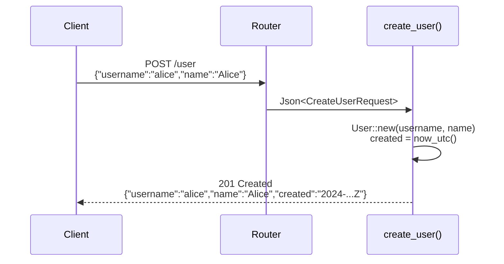
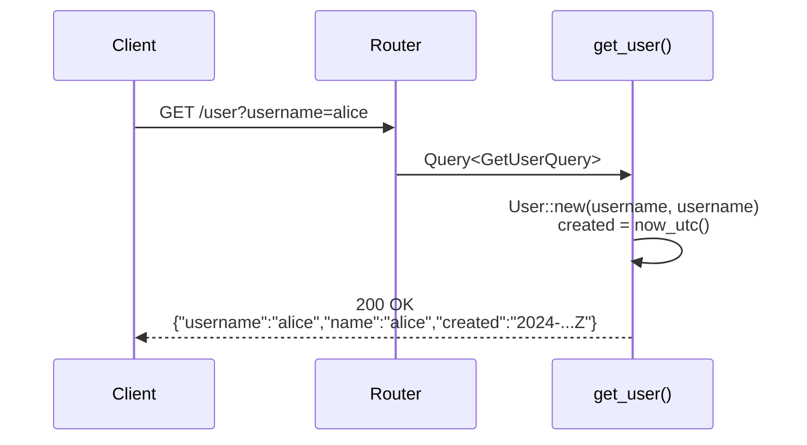
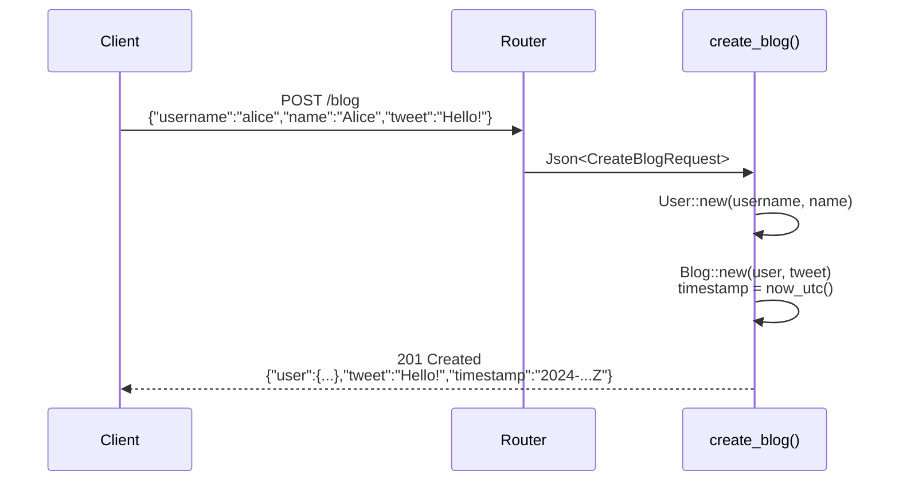
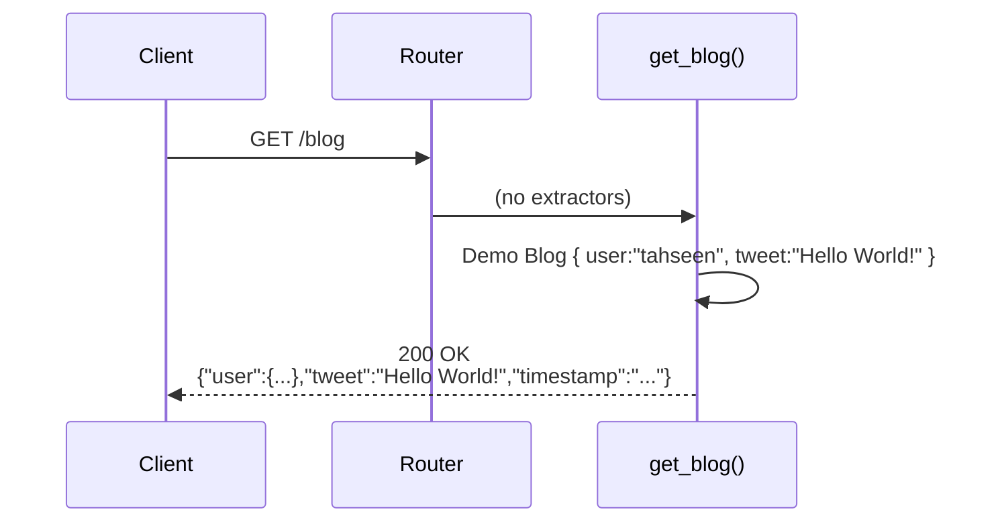

# Basic Web App in Rust

A minimal REST API built with [Axum](https://docs.rs/axum) and [Tokio](https://tokio.rs/), demonstrating idiomatic Rust HTTP server patterns: typed extractors, separate request/response structs, and RFC 3339 timestamps.

---

## Tech Stack

| Component | Crate | Role |
|-----------|-------|------|
| HTTP framework | `axum 0.8` | Routing, extractors, JSON responses |
| Async runtime | `tokio 1` | Multi-threaded executor |
| Serialization | `serde 1` | JSON encode/decode |
| Timestamps | `time 0.3` | RFC 3339 date-time, `OffsetDateTime::now_utc()` |

---

## Project Structure

```
src/
├── main.rs                  # Entry point — binds TcpListener, starts axum::serve
├── models/
│   ├── user.rs              # User request/response types + handlers
│   └── blog.rs              # Blog request/response types + handlers
└── routes/
    ├── routes.rs            # Merges all sub-routers into one Router
    ├── user_routes.rs       # /user GET + POST
    └── blog_routes.rs       # /blog GET + POST
```

---

## Architecture

```
┌────────────────────────────────────────────────────────┐
│                      HTTP Client                       │
└───────────────────────────┬────────────────────────────┘
                            │ TCP :3000
                            ▼
┌────────────────────────────────────────────────────────┐
│                  Axum Router (axum::Router)            │
│                                                        │
│   merge(user_routes())   merge(blog_routes())          │
│      /user GET POST          /blog GET POST            │
└──────────────┬──────────────────────┬──────────────────┘
               │                      │
               ▼                      ▼
┌─────────────────────┐  ┌──────────────────────────┐
│   models/user.rs    │  │     models/blog.rs        │
│                     │  │                           │
│ CreateUserRequest   │  │  CreateBlogRequest        │
│ GetUserQuery        │  │  Blog { user, tweet,      │
│ User (response)     │  │        timestamp }        │
│                     │  │                           │
│ create_user()       │  │  create_blog()            │
│ get_user()          │  │  get_blog()               │
└─────────────────────┘  └──────────────────────────┘
               │                      │
               └──────────┬───────────┘
                          ▼
               OffsetDateTime::now_utc()
               (RFC 3339 in all responses)
```

---

## API Endpoints

| Method | Route   | Request body / Query          | Status | Description         |
|--------|---------|-------------------------------|--------|---------------------|
| `POST` | `/user` | JSON `{username, name}`       | 201    | Create a user       |
| `GET`  | `/user` | Query `?username=<value>`     | 200    | Retrieve a user     |
| `POST` | `/blog` | JSON `{username, name, tweet}`| 201    | Create a blog post  |
| `GET`  | `/blog` | —                             | 200    | Retrieve sample blog|

---

## Sequence Diagrams

### POST /user



### GET /user



### POST /blog



### GET /blog



---

## Request / Response Schemas

### User

**Request** (`POST /user` body)
```json
{
  "username": "alice",
  "name": "Alice Smith"
}
```

**Response** (all user endpoints)
```json
{
  "username": "alice",
  "name": "Alice Smith",
  "created": "2024-06-30T10:15:30Z"
}
```

### Blog

**Request** (`POST /blog` body)
```json
{
  "username": "alice",
  "name": "Alice Smith",
  "tweet": "Hello from Rust!"
}
```

**Response** (all blog endpoints)
```json
{
  "user": {
    "username": "alice",
    "name": "Alice Smith",
    "created": "2024-06-30T10:15:30Z"
  },
  "tweet": "Hello from Rust!",
  "timestamp": "2024-06-30T10:15:30Z"
}
```

---

## Getting Started

```bash
git clone https://github.com/tahseenjamal/basic-web-app-in-rust.git
cd basic-web-app-in-rust
cargo run
```

Server starts at `http://127.0.0.1:3000`.

### Example requests

```bash
# Create a user
curl -s -X POST http://127.0.0.1:3000/user \
  -H 'Content-Type: application/json' \
  -d '{"username":"alice","name":"Alice Smith"}' | jq

# Get a user
curl -s "http://127.0.0.1:3000/user?username=alice" | jq

# Create a blog post
curl -s -X POST http://127.0.0.1:3000/blog \
  -H 'Content-Type: application/json' \
  -d '{"username":"alice","name":"Alice Smith","tweet":"Hello from Rust!"}' | jq

# Get the demo blog
curl -s http://127.0.0.1:3000/blog | jq
```

---

## Design Decisions

- **Separate request and response structs** — `CreateUserRequest` / `GetUserQuery` are input-only; `User` is output-only. This prevents the `created` (server-generated) field from leaking into client input requirements.
- **`OffsetDateTime::now_utc()`** — all timestamps are server-assigned at request time; clients never need to supply them.
- **RFC 3339** — timestamps serialize to a human-readable, standard string (`time::serde::rfc3339`).
- **Stateless demo** — no database; `GET /user` echoes the supplied username. Extend by adding a `sqlx` pool to the router state.
